# APR Loading Fix & Naming Correction Summary

## Issues Fixed

### 1. APR Shows "N/A" Instead of Loading State
**Problem**: APR column showed "N/A" for all assets instead of showing a loading skeleton while data was being fetched.

**Root Cause**: The APR calculation wasn't waiting for required data to load:
- Token prices from `Distributor.depositPools()` contract calls
- Daily emissions from server-side API
- Contract data including reward pool rates

### 2. Naming Inconsistency: APY vs APR
**Problem**: Code used `apy` in interfaces but calculated **APR** (Annual Percentage Rate), not APY (Annual Percentage Yield).

**Clarification**:
- **APR** = Simple interest (no compounding)
- **APY** = Compound interest (auto-compounding)
- Morpheus protocol doesn't auto-compound rewards → correct term is **APR**

## Changes Made

### A. Added Daily Emissions Fetching to `use-capital-pool-data.ts`

#### 1. Added State Management (Lines 65-122)
```typescript
const [dailyEmissions, setDailyEmissions] = useState<number | null>(null);
const [isLoadingDailyEmissions, setIsLoadingDailyEmissions] = useState<boolean>(false);
const [dailyEmissionsError, setDailyEmissionsError] = useState<string | null>(null);

useEffect(() => {
  async function fetchDailyEmissions(): Promise<void> {
    // Fetches from /api/daily-emissions?networkEnv=...
    // Updates dailyEmissions state with real-time data
  }
  fetchDailyEmissions();
}, [networkEnvironment]);
```

#### 2. Added Loading Checks in APR Calculation (Lines 452-479)
```typescript
const calculateV7APR = useMemo(() => {
  // ⏳ CHECK #1: Wait for daily emissions to be loaded
  if (isLoadingDailyEmissions) {
    console.log('⏳ [APR CALC] Waiting for daily emissions to load...');
    return null; // Return null to indicate loading state
  }

  // ❌ CHECK #2: Verify we have valid daily emissions data
  if (!dailyEmissions || dailyEmissions <= 0) {
    console.log('❌ [APR CALC] Daily emissions not available');
    return null;
  }

  // ⏳ CHECK #3: Wait for distributor pool results (contains token prices!)
  if (!distributorPoolResults || distributorPoolResults.length === 0) {
    console.log('⏳ [APR CALC] Waiting for distributor pool results (token prices)...');
    return null;
  }

  // ⏳ CHECK #4: Check if distributor results have loaded successfully
  const hasValidDistributorData = distributorPoolResults.some(r => r?.status === 'success');
  if (!hasValidDistributorData) {
    console.log('⏳ [APR CALC] Distributor pool data not ready yet');
    return null;
  }

  // Proceed with calculation only when ALL data is available...
}, [/* dependencies including dailyEmissions, isLoadingDailyEmissions */]);
```

#### 3. Updated Asset Data to Handle Null APR (Lines 888, 922)
```typescript
result[symbol] = {
  totalStaked,
  apr: (calculateV7APR && calculateV7APR[symbol]) || 'N/A',
  isLoading: contract.isLoading || rewardRateData?.isLoading || isLoadingDailyEmissions || false,
  error: (contract.error || rewardRateData?.error) as Error | null
};
```

**Key Addition**: Added `isLoadingDailyEmissions` to the `isLoading` flag so the UI shows loading state.

### B. Fixed Naming: APY → APR

#### 1. Updated Interfaces

**`hooks/use-capital-pool-data.ts` (Line 17)**
```typescript
export interface AssetPoolData {
  totalStaked: string;
  apr: string; // Renamed from 'apy' - we calculate APR (no compounding), not APY
  isLoading: boolean;
  error: Error | null;
  aprLoading?: boolean;
}
```

**`components/capital/types/asset.ts` (Line 3)**
```typescript
export interface Asset {
  symbol: string;
  apr: string; // Renamed from 'apy' - we calculate APR (no compounding), not APY
  totalStaked: string;
  icon: string;
  disabled?: boolean;
}
```

**`app/hooks/useCapitalMetrics.ts` (Line 177)**
```typescript
export interface CapitalMetrics {
  totalValueLockedUSD: string;
  currentDailyRewardMOR: string;
  avgAprRate: string; // Renamed from avgApyRate
  activeStakers: string;
  isLoading: boolean;
  error: string | null;
  // ... token prices
}
```

#### 2. Updated All References

**Files Updated**:
- `hooks/use-capital-pool-data.ts`: 5 locations
- `components/capital/capital-info-panel.tsx`: 3 locations
- `app/hooks/useCapitalMetrics.ts`: 8 locations
- `components/capital/chart-section.tsx`: 3 locations

**Pattern Changed**:
- `asset.apy` → `asset.apr`
- `avgApyRate` → `avgAprRate`
- `displayApyRate` → `displayAprRate`
- Variable `avgApy` → `avgApr`
- Variable `weightedApySum` → `weightedAprSum`

## Debug Logging Added

### Comprehensive Debug Output
```typescript
console.log('🔢 [APR CALC] COMPREHENSIVE DEBUG - V7 APR CALCULATION:', {
  networkEnvironment,
  totalDailyEmissions,
  isLoadingDailyEmissions,
  dailyEmissionsError,
  distributorV2Address,
  rewardPoolV2Address,
  contractCallResults: {
    distributorPools: distributorPoolResults?.map((r, i) => ({
      asset: configuredAssets[i]?.metadata.symbol,
      status: r?.status,
      hasResult: !!r?.result,
      // Log token price if available
      tokenPrice: r?.status === 'success' ? formatUnits(r.result[2], 18) : 'N/A'
    })),
    // ... more debug info
  }
});
```

**Log Prefixes**:
- `⏳ [APR CALC]` - Waiting for data
- `✅ [APR CALC]` - Success/completion
- `❌ [APR CALC]` - Error/missing data
- `💰 [APR CALC]` - Daily emissions info
- `🔢 [APR CALC]` - Calculation details

## Expected Behavior After Fix

### Before Fix ❌
```
Asset    APR        Total Deposited
stETH    N/A        1,234.56
USDT     N/A        567,890
wETH     N/A        12.34
```

### After Fix ✅

**During Loading**:
```
Asset    APR        Total Deposited
stETH    [skeleton] 1,234.56
USDT     [skeleton] 567,890
wETH     [skeleton] 12.34
```

**After Loading**:
```
Asset    APR        Total Deposited
stETH    12.45%     1,234.56
USDT     15.67%     567,890
wETH     8.23%      12.34
```

## Data Flow Sequence

```mermaid
sequenceDiagram
    participant UI as Capital Page
    participant Hook as use-capital-pool-data
    participant API as /api/daily-emissions
    participant Contracts as L1 Contracts

    UI->>Hook: Mount component
    Hook->>API: Fetch daily emissions
    Hook->>Contracts: Get distributor pool data (prices)
    Hook->>Contracts: Get reward pool rates
    Hook->>Contracts: Get aToken balances
    
    Note over Hook: ⏳ All data loading...
    Note over UI: Shows skeleton loaders
    
    API-->>Hook: Daily emissions: 3,456 MOR
    Contracts-->>Hook: Token prices loaded
    Contracts-->>Hook: Reward rates loaded
    Contracts-->>Hook: aToken balances loaded
    
    Note over Hook: ✅ Calculate APR per asset
    Hook-->>UI: Asset data with APR values
    
    Note over UI: Display APR percentages
```



## Testing Checklist

- [x] APR shows loading skeleton while data is fetching
- [x] APR displays correct percentage after data loads
- [x] Debug logs show proper sequencing
- [x] Token prices are logged for verification
- [x] All naming changed from APY to APR
- [x] No TypeScript/lint errors
- [x] Loading states propagate to UI components

## Files Modified

1. `/hooks/use-capital-pool-data.ts` - Main APR calculation logic
2. `/components/capital/capital-info-panel.tsx` - APR display component
3. `/components/capital/types/asset.ts` - Asset interface
4. `/app/hooks/useCapitalMetrics.ts` - Metrics aggregation
5. `/components/capital/chart-section.tsx` - Chart metrics display

## Related Documentation

- [APR Calculation Explanation](./APR_CALCULATION_EXPLANATION.md) - Detailed explanation of v7 protocol APR calculation
- [Morpheus v7 Protocol Yield Generation](https://gitbook.mor.org/smart-contracts/documentation/distribution-protocol/v7-protocol/guides/protocol-yield-generation)

---

**Last Updated**: October 3, 2025
**Author**: AI Assistant
**Status**: ✅ Complete - All issues resolved


